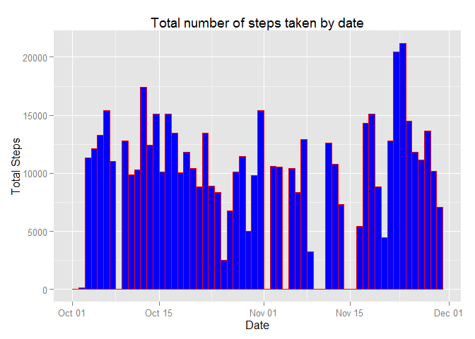
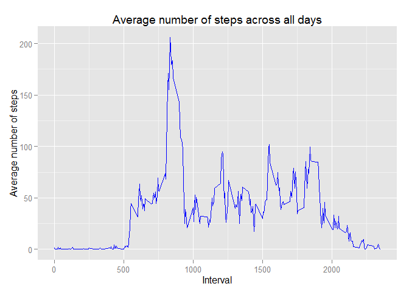
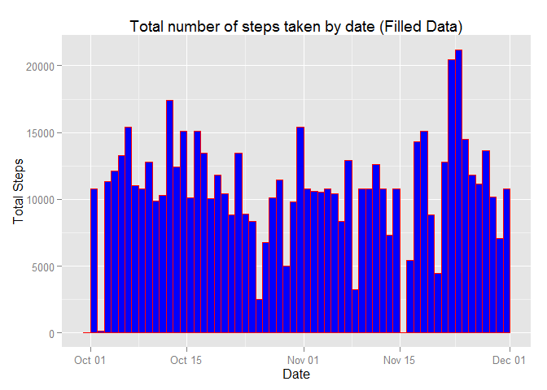
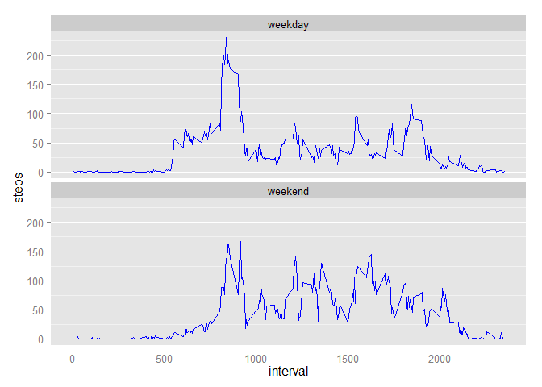

# Reproducible Research: Peer Assessment 1
Weichen Ouyang  
Sunday, December 14, 2014  
<br/>

## 1.Loading and preprocessing the data
1.1 Load the data:   


```r
## First, unzip data file: "activity.zip".
fname = unzip(zipfile = "activity.zip")

## Then, read the raw data into variable "data".
data<-read.csv(fname, header = TRUE)
summary(data)
```

```
##      steps                date          interval     
##  Min.   :  0.00   2012-10-01:  288   Min.   :   0.0  
##  1st Qu.:  0.00   2012-10-02:  288   1st Qu.: 588.8  
##  Median :  0.00   2012-10-03:  288   Median :1177.5  
##  Mean   : 37.38   2012-10-04:  288   Mean   :1177.5  
##  3rd Qu.: 12.00   2012-10-05:  288   3rd Qu.:1766.2  
##  Max.   :806.00   2012-10-06:  288   Max.   :2355.0  
##  NA's   :2304     (Other)   :15840
```
<br />
<br />

1.2 Convert the format of data.
        I choose to convert the "date" column of data to be the 'date' class of R. And the format of the processed data is showed as follows: 

```r
## Convert the "date" column to be of the built-in "date" format
data$date<-as.Date(data$date,"%Y-%m-%d")

## Show the format of data
str(data)
```

```
## 'data.frame':	17568 obs. of  3 variables:
##  $ steps   : int  NA NA NA NA NA NA NA NA NA NA ...
##  $ date    : Date, format: "2012-10-01" "2012-10-01" ...
##  $ interval: int  0 5 10 15 20 25 30 35 40 45 ...
```
<br/>
<br/>

1.3 Load the relevant library for plotting.

```r
library(ggplot2)
```

```
## Warning: package 'ggplot2' was built under R version 3.1.2
```

```r
library(plyr)
```

```
## Warning: package 'plyr' was built under R version 3.1.2
```
<br/>
<br/>
  
## 2.What is mean total number of steps taken per day?
2.1 For this part of the assignment, the missing values in the dataset are ignored.

```r
cleanData<-na.omit(data)
```

2.2 Make a histogram of the total number of steps taken each day through 2012-10-01 to 2012-11-30

```r
## Aggregate steps by date
result<-ddply(cleanData, "date", summarize, steps=sum(steps))

## Plot histogram
qplot(date, data=result, weight=steps, geom="histogram", binwidth = 1, color = I("red"), fill=I("blue")) + labs(title = "Total number of steps taken by date")  +  labs(x="Date", y="Total Steps")
```

 

2.3 Calculate and report the mean and median total number of steps taken per day  

#####The mean number of steps per day is 10766.

#####The median of number of steps per day is 10765.
<br />
<br />
  
## 3.What is the average daily activity pattern?

3.1 We first tabulate the average number of steps taken, across all days, against 5-minute intervals using the above clean dataset. 

```r
dataByInterval <- aggregate(cleanData$steps, list(interval = cleanData$interval), FUN = "mean")
colnames(dataByInterval) <- c("interval", "avSteps")
```

3.2 The following plot shows a time series plot of the average number of steps taken against the 5-minute intervals. 

```r
ggplot(dataByInterval, aes(interval, avSteps)) +
    geom_line(colour="blue") +
    labs(title="Average number of steps across all days", 
         x="Interval", y="Average number of steps")
```

 

3.3 Find out the 5-minute interval that contains the maximum number of steps on average across all the days.

```r
maxInterval <- dataByInterval[dataByInterval$avSteps==max(dataByInterval$avSteps), ] 
```
#####The 5-minute interval that contains the maximum average steps is 835.

#####The corresponding max average steps is 206.1698113.
<br />
<br />

## 4.Imputing missing values
Note that there are a number of days/intervals where there are missing values (coded as NA). The presence of missing days may introduce bias into some calculations or summaries of the data.

4.1 Calculate and report the total number of missing values in the dataset (i.e. the total number of rows with NAs)


```r
missingTotal<-nrow(data)-nrow(cleanData)
missingTotal
```

```
## [1] 2304
```

#####There are in total 2304 misssing values in the dataset. 
<br />


4.2 Devise a strategy for filling in all of the missing values in the dataset. The strategy does not need to be sophisticated. For example, you could use the mean/median for that day, or the mean for that 5-minute interval, etc.

#####Strategy: I choose to filling in all of the missing values in the dataset using the mean for that specific 5-minute interval. 
<br/>

4.3 Create a new dataset that is equal to the original dataset but with the missing data filled in.

```r
filledData <- data
for(id in 1:nrow(filledData)){
    if (is.na(data$steps[id])){
        filledData$steps[id] <- dataByInterval$avSteps[which(data$interval[id]==dataByInterval$interval)]
    }
}
```
<br/>

4.4 Make a histogram of the total number of steps taken each day and Calculate and report the mean and median total number of steps taken per day. Do these values differ from the estimates from the first part of the assignment? What is the impact of imputing missing data on the estimates of the total daily number of steps?  
    Now, repeat the steps in Question 2:  
    <br />
    a. Make a histogram of the total number of steps taken each day based on the new filled-Data.


```r
## Aggregate steps by date
newResult<-ddply(filledData, "date", summarize, steps=sum(steps))

## Plot histogram
qplot(date, data=newResult, weight=steps, geom="histogram", binwidth = 1, color = I("red"), fill=I("blue")) + labs(title = "Total number of steps taken by date (Filled Data)")  +  labs(x="Date", y="Total Steps")
```

 
  
##### Observation: It is obivious that the majority of the empty bar lies on the previous plot had been filled.
  
  <br />
  
  
b. Calculate and report the mean and median total number of steps taken per day  

The new mean daily steps is:

```r
mean(newResult$steps)
```

```
## [1] 10766.19
```
  
The new median daily steps is:

```r
median(newResult$steps)
```

```
## [1] 10766.19
```
##### Observation: The previous mean is 10766.19 and the previous median is 10765, while for the NA-filled data, the mean stays the same and the median increased to be 10766.19 as well.
  <br/>
  <br/>
  
## 5. Are there differences in activity patterns between weekdays and weekends?
5.1 To identify differences between daily behavior on weekend days versus weekdays, we first associate a new value with each reading to distinguish it as a weekend or weekday reading. For this part of the analysis, we use the data set with the filled-data.


```r
weekendFn <- function(date) if (weekdays(date) %in% c("Saturday", "Sunday")) "weekend" else "weekday"
filledData$weekend <- factor(sapply(filledData$date, weekendFn))
```

<br/>
5.2 Make a panel plot containing a time series plot (i.e. type = "l") of the 5-minute interval (x-axis) and the average number of steps taken, averaged across all weekday days or weekend days (y-axis). See the README file in the GitHub repository to see an example of what this plot should look like using simulated data.

```r
ggplot(filledData, aes(x = interval, y = steps)) +
  stat_summary(fun.y = mean, geom = "line", colour="blue") +
  facet_wrap( ~ weekend, nrow = 2)
```

 


##### Observation: There is a distinct difference in the pattern on average number of steps by weekday vs weekend. It's noticeable that after 10am, the activity level of weekend is much less than that of weekdays. In the meanwhile, most weekdays' activities, in terms of steps, are centralized around 8am to 10am. For weekends, however, activities are scattered much more evenly.
